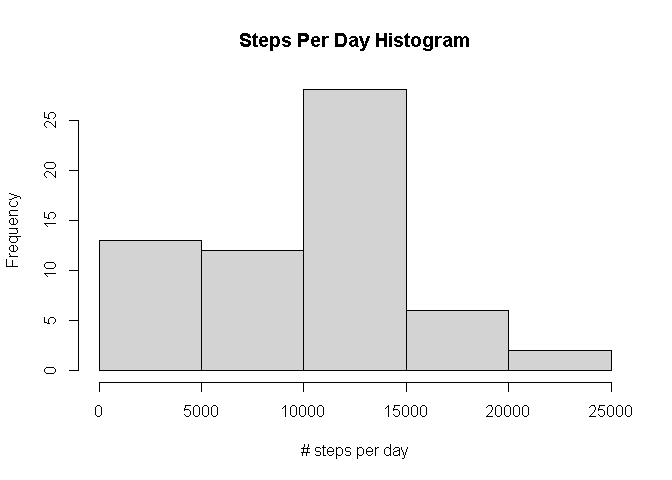
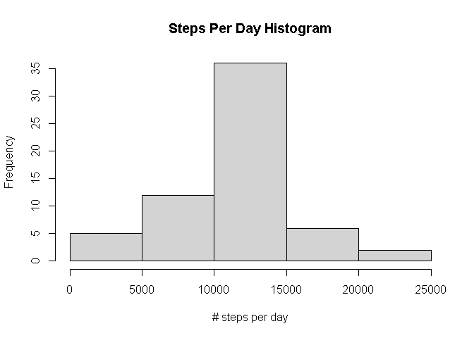

## Loading and preprocessing the data

```r
data <- read.csv('activity.csv')
```
## What is mean total number of steps taken per day?
### The total number of steps taken per day

```r
daily_steps <- tapply(data$steps, 
                      data$date, 
                      function(x){mean(x, na.rm = TRUE)})
head(daily_steps)
```

```
## 2012-10-01 2012-10-02 2012-10-03 2012-10-04 2012-10-05 2012-10-06 
##        NaN    0.43750   39.41667   42.06944   46.15972   53.54167
```
### Histogram of the total number of steps taken each day

```r
hist(daily_steps, main = 'Steps Per Day Histogram', xlab = '# steps per day')
```

<!-- -->

### Mean of steps per day

```r
mean(daily_steps, na.rm = TRUE)
```

```
## [1] 37.3826
```
### Median of steps per day

```r
median(daily_steps, na.rm = TRUE)
```

```
## [1] 37.37847
```
## What is the average daily activity pattern?

```r
interval_steps <- tapply(data$steps, 
                      data$interval, 
                      function(x){mean(x, na.rm = TRUE)})
```
### Timeseries plot

```r
plot(y=interval_steps,
     x=names(interval_steps),
     type = 'l', 
     xlab = 'Interval', 
     ylab = 'Avarage # of steps')
```

<!-- -->

### Interval with max number of steps

```r
sprintf("Interval with max number of steps: %s",
        names(interval_steps)[which.max(interval_steps)])
```

```
## [1] "Interval with max number of steps: 835"
```

## Imputing missing values
### Number of rows with NA

```r
sum(apply(is.na(data),1,any))
```

```
## [1] 2304
```
### Fill NAs by mean of interval

```r
library(tidyr)
library(dplyr)
```

```
## 
## Attaching package: 'dplyr'
```

```
## The following objects are masked from 'package:stats':
## 
##     filter, lag
```

```
## The following objects are masked from 'package:base':
## 
##     intersect, setdiff, setequal, union
```

```r
nan_mask = apply(is.na(data), 1, any)
filled_data <- data %>%
  group_by(interval) %>%
  mutate_all(funs(ifelse(is.na(.), mean(., na.rm = TRUE),.)))
```

```
## `mutate_all()` ignored the following grouping variables:
## Column `interval`
## Use `mutate_at(df, vars(-group_cols()), myoperation)` to silence the message.
```

```
## Warning: funs() is soft deprecated as of dplyr 0.8.0
## Please use a list of either functions or lambdas: 
## 
##   # Simple named list: 
##   list(mean = mean, median = median)
## 
##   # Auto named with `tibble::lst()`: 
##   tibble::lst(mean, median)
## 
##   # Using lambdas
##   list(~ mean(., trim = .2), ~ median(., na.rm = TRUE))
## This warning is displayed once per session.
```
### Histogram of the total number of steps taken each day (filled NAs)

```r
daily_steps_filled <- tapply(filled_data$steps,
                             filled_data$date,
                             function(x){mean(x, na.rm = TRUE)})
hist(daily_steps_filled, main = 'Steps Per Day Histogram', 
     xlab = '# steps per day')
```

<!-- -->

### Mean of steps per day (filled NAs)

```r
mean(daily_steps_filled)
```

```
## [1] 37.3826
```

### Median of steps per day (filled NAs)

```r
median(daily_steps_filled)
```

```
## [1] 37.3826
```
### Do these values differ from the estimates from the first part of the assignment?


### What is the impact of imputing missing data on the estimates of the total daily number of steps?

#### Mean - Mean(filled NAs)

```r
mean(daily_steps) - mean(daily_steps_filled)
```

```
## [1] NaN
```
#### Median - Median(filled NAs)

```r
median(daily_steps) - median(daily_steps_filled)
```

```
## [1] NA
```
## Are there differences in activity patterns between weekdays and weekends?

```r
library(lubridate)
```

```
## 
## Attaching package: 'lubridate'
```

```
## The following objects are masked from 'package:dplyr':
## 
##     intersect, setdiff, union
```

```
## The following objects are masked from 'package:base':
## 
##     date, intersect, setdiff, union
```

```r
is_weekend <- wday(as.Date(data$date))>5
data$is_weekend <- factor(is_weekend, labels = c('weekday', 'weekend'))
```


```r
interval_steps_week <- tapply(data$steps,
                              list(data$interval, data$is_weekend),
                              function(x){mean(x, na.rm = TRUE)})
par(mfrow=c(1,2))
plot(interval_steps_week[,'weekday'], 
     type = 'l',
     xlab = 'Interval', 
     ylab = 'Avarage # of steps',
     main='Weekday')
plot(interval_steps_week[,'weekend'], 
     type = 'l',
     xlab = 'Interval', 
     ylab = 'Avarage # of steps',
     main='Weekend')
```

<!-- -->
